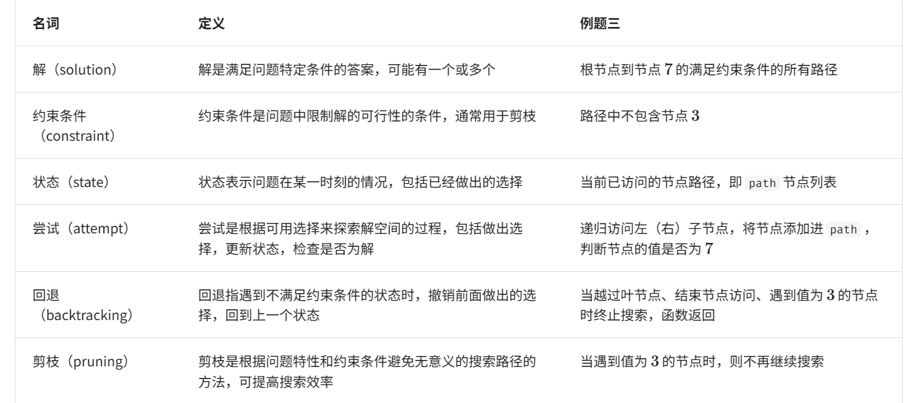

# 回溯算法

「回溯算法 backtracking algorithm」是一种通过穷举来解决问题的方法，它的核心思想是从一个初始状态出发，暴力搜索所有可能的解决方案，当遇到正确的解则将其记录，直到找到解或者尝试了所有可能的选择都无法找到解为止。

## 引入

### 例题1

给定一棵二叉树，搜索并记录所有值为7的节点，请返回节点列表。

```c++
vector<TreeNode *> res;
void search(TreeNode *root){
    if(root == nullptr)
        return;
    if(root -> val == 7)
        res.push_back(root);
    search(root -> left);
    search(root -> right);
}
```

访问每一个节点代表着尝试，遇到叶节点返回代表着回退。

## 尝试与回退

之所以称之为回溯算法，是因为该算法在搜索解空间时会采用“尝试”与“回退”的策略。当算法在搜索过程中遇到某个状态无法继续前进或无法得到满足条件的解时，它会撤销上一步的选择，退回到之前的状态，并尝试其他可能的选择。

### 例题2

在二叉树中搜索所有值为7的节点，请返回根节点到这些节点的路径。

```c++
vector<vector<TreeNode*> > res;
vector<TreeNode*> path;
void preOrder(TreeNode* root){
    if(root == nullptr)
        return;
    
    path.push_back(root);
    if(root -> val == 7){
        //记录解
        res.push_back(path);
    }
    preOrder(root -> left);
    preOrder(root -> right);
    //回退
    path.pop_back();
}
```

## 剪枝

复杂的回溯问题通常包含一个或多个约束条件，约束条件通常可用于“剪枝”。

### 例题3

在二叉树中搜索所有值为7的节点，请返回根节点到这些节点的路径，并要求路径中不包含值为3的节点。

```c++
vector<vector<TreeNode*>> res;
vector<TreeNode*> path;

void preOrder(TreeNode* root){

    //剪枝
    if(root == nullptr || root -> val == 3)
        return;

    path.push_back(root);
    
    if(root -> val == 7)
        res.push_back(path);

    preOrder(root -> left);
    preOrder(root -> right);

    path.pop_back();
    
}
```

## 框架代码

`state`表示问题的当前状态，`choices`表示当前状态下可以做出的选择

```c++
/* 回溯算法框架 */
void backtrack(State *state, vector<Choice *> &choices, vector<State *> &res) {
    // 判断是否为解
    if (isSolution(state)) {
        // 记录解
        recordSolution(state, res);
        // 不再继续搜索
        return;
    }
    // 遍历所有选择
    for (Choice choice : choices) {
        // 剪枝：判断选择是否合法
        if (isValid(state, choice)) {
            // 尝试：做出选择，更新状态
            makeChoice(state, choice);
            backtrack(state, choices, res);
            // 回退：撤销选择，恢复到之前的状态
            undoChoice(state, choice);
        }
    }
}
```

### 按照框架

状态 state 为节点遍历路径，选择 choices 为当前节点的左子节点和右子节点，结果 res 是路径列表：

```c++

bool isSolution(vector<TreeNode*> &state){
    return !state.empty() && state.back() -> val == 7;
}

void recordSolution(vector<TreeNode*> &state, vector<vector<TreeNode*>> &res){
    res.push_back(state);
}

bool isValid(vector<TreeNode*> &state, TreeNode* choice){
    return choice != nullptr && choice -> val != 3;
}

void makeChoice(vector<TreeNode*> &state, TreeNode* choice){
    state.push_back(choice);
}

void undoChoice(vector<TreeNode*> &state, TreeNode* choice){
    state.pop_back();
}

void backtrack(vector<TreeNode*> &state,vector<TreeNode*> &choices, vector<vector<TreeNode*>> &res){
    // 检查是否为解
    if (isSolution(state)) {
        // 记录解
        recordSolution(state, res);
    }
    // 遍历所有选择
    for (TreeNode *choice : choices) {
        // 剪枝：检查选择是否合法
        if (isValid(state, choice)) {
            // 尝试：做出选择，更新状态
            makeChoice(state, choice);
            // 进行下一轮选择
            vector<TreeNode *> nextChoices{choice->left, choice->right};
            backtrack(state, nextChoices, res);
            // 回退：撤销选择，恢复到之前的状态
            undoChoice(state, choice);
        }
    }
}
```

## 常用术语



## 回溯典型例题

### 搜索问题

这类问题的目标是找到满足特定条件的解决方案

* 全排列问题：给定一个集合，求出其所有可能的排列组合。
* 子集和问题：给定一个集合和一个目标和，找到集合中所有和为目标和的子集。
* 汉诺塔问题：给定三根柱子和一系列大小不同的圆盘，要求将所有圆盘从一根柱子移动到另一根柱子，每次只能移动一个圆盘，且不能将大圆盘放在小圆盘上。

### 约束满足问题

这类问题的目标是找到满足所有约束条件的解。

* n皇后：$在n\times n的棋盘上放置n个皇后，使得他们互不攻击。$
* 数独:$在9\times 9的网格中填入数字1 \sim 9 ,使得每行、每列和每个3\times 3子网格中的数字不重复。$
* 图着色问题:给定一个无向图，用最少的颜色给图的每个顶点着色，使得相邻顶点颜色不同。

### 组合优化问题

这类问题的目标是在一个组合空间中找到满足某些条件的最优解。

* 0-1 背包问题：给定一组物品和一个背包，每个物品有一定的价值和重量，要求在背包容量限制内，选择物品使得总价值最大。
* 旅行商问题：在一个图中，从一个点出发，访问所有其他点恰好一次后返回起点，求最短路径。
* 最大团问题：给定一个无向图，找到最大的完全子图，即子图中的任意两个顶点之间都有边相连。

请注意，对于许多组合优化问题，回溯不是最优解决方案。

0-1 背包问题通常使用动态规划解决，以达到更高的时间效率。\
旅行商是一个著名的 NP-Hard 问题，常用解法有遗传算法和蚁群算法等。\
最大团问题是图论中的一个经典问题，可用贪心算法等启发式算法来解决。
