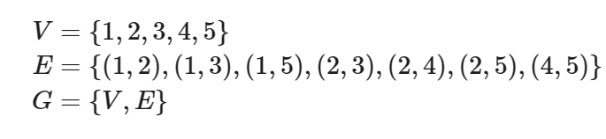
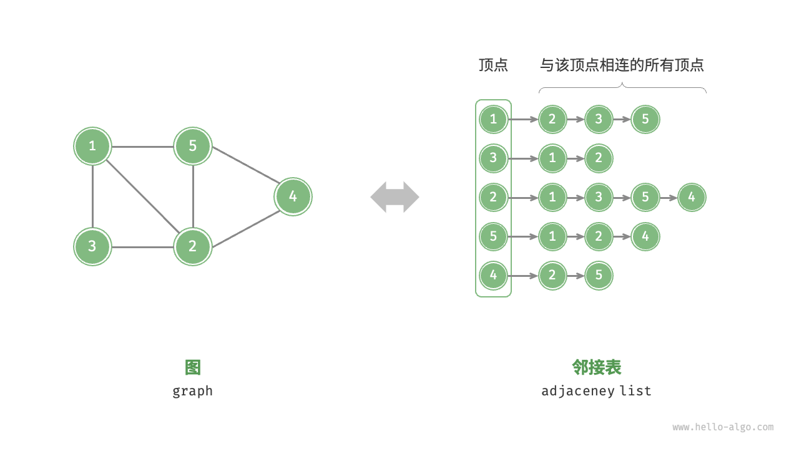
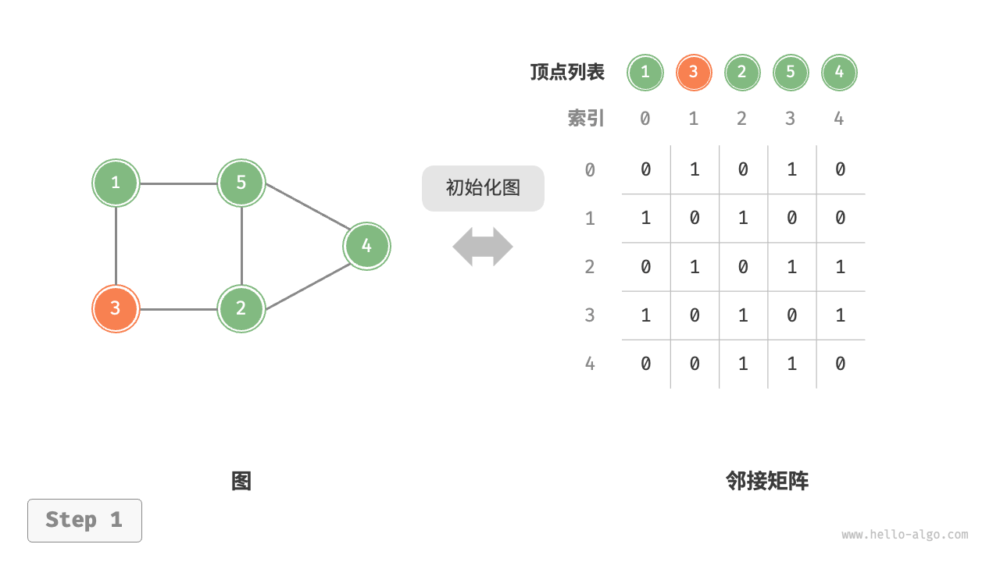
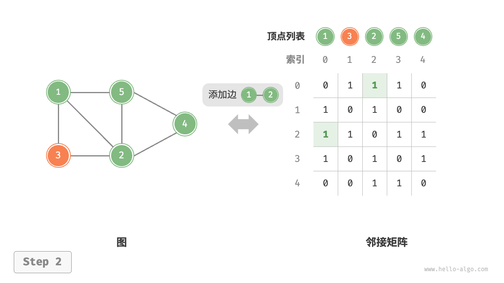
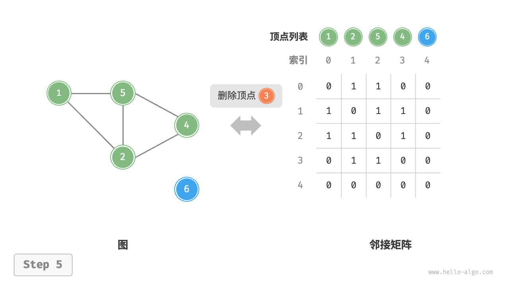
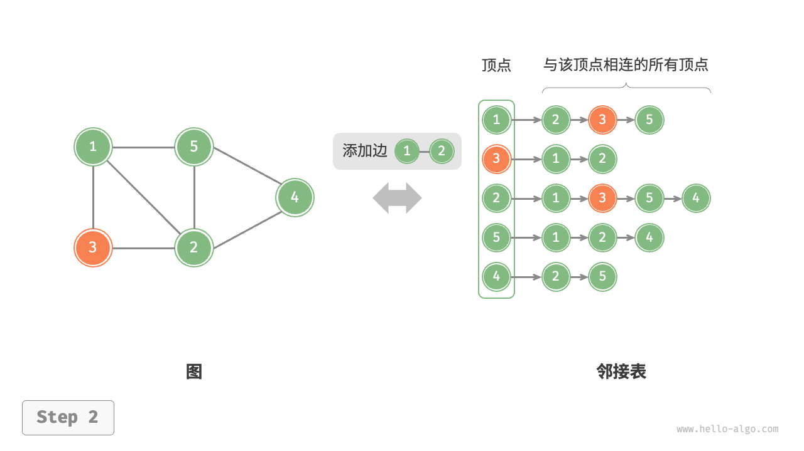
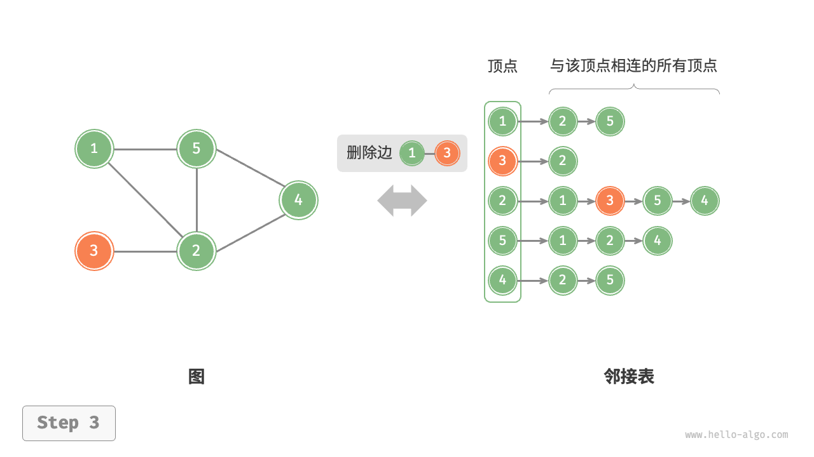
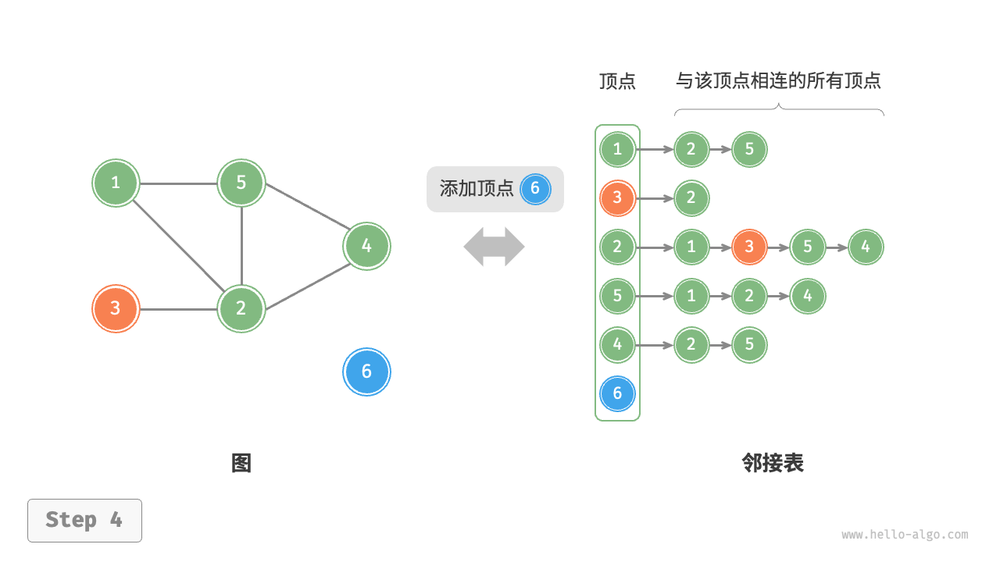

# 图(graph)

## 定义

「图 graph」是一种非线性数据结构，由「顶点 vertex」和「边 edge」组成。我们可以将图$G$抽象地表示为一组顶点$V$和一组边$E$ 的集合。以下示例展示了一个包含 5 个顶点和 7 条边的图。

如果将顶点看作节点，将边看作连接各个节点的引用（指针），我们就可以将图看作一种从链表拓展而来的数据结构。如图 9-1 所示，相较于线性关系（链表）和分治关系（树），网络关系（图）的自由度更高，因而更为复杂。

## 图的常见类型与术语

$$
    图
    \begin{cases}
        有向图(directed \space graph)\\
        无向图(undirected\space graph)
    \end{cases}
$$

## 图的表示

### 邻接矩阵

$$
    设图的顶点数量为n, ``邻接矩阵 adjacency\space matri''使用\\一个n \times n大小的矩阵来表示图，每一行(列)代表一个顶点，\\矩阵元素代表边，用1或0表示两个顶点之间是否存在边。

    \\设邻接矩阵为M、顶点列表为V，那么矩阵元素M[i,j] = 1\\表示顶点V[i]到顶点V[j]之间存在边，反之M[I,J]=0表示两顶点之间无边。
$$

#### 性质

1. 顶点不能与自身相连，因此邻接矩阵主对角线元素没有意义。
2. 对于无向图，两个方向的边等价，此时邻接矩阵关于主对角线对称。
3. 将邻接矩阵的元素从1和0替换为权重，则可表示有权图。

使用邻接矩阵表示图时，我们可以直接访问矩阵元素以获取边，因此增删查改操作的效率很高，时间复杂度均为$O(1)$。然而，矩阵的空间复杂度为$O(n^2)$，内存占用较多。

### 邻接表

「邻接表 adjacency list」使用n个链表来表示图，链表节点表示顶点。第i个链表对应顶点i，其中存储了该顶点的所有邻接顶点（与该顶点相连的顶点）。图 9-6 展示了一个使用邻接表存储的图的示例。

邻接表仅存储实际存在的边，而边的总数通常远小于$n^2$
 ，因此它更加节省空间。然而，在邻接表中需要通过遍历链表来查找边，因此其时间效率不如邻接矩阵。

 观察图 9-6 ，邻接表结构与哈希表中的“链式地址”非常相似，因此我们也可以采用类似的方法来优化效率。比如当链表较长时，可以将链表转化为 AVL 树或红黑树，从而将时间效率从$O(n)$优化至$O(log n)$；还可以把链表转换为哈希表，从而将时间复杂度降至$O(1)$。

## 图的基本操作

### 基于邻接矩阵的实现

给定一个顶点为$n$的无向图。

1. 添加或删除边：直接在邻接矩阵中修改指定的边即可，使用$O(1)$ 时间。而由于是无向图，因此需要同时更新两个方向的边。
2. 添加顶点：在邻接矩阵的尾部添加一行一列，并全部填0即可，使用$O(n)$时间。
3. 删除顶点：在邻接矩阵中删除一行一列。当删除首行首列时达到最差情况，需要将$(n-1)^2$个元素“向左上移动”，从而使用$O(n^2)$
时间.
4. 初始化：传入n个顶点，初始化长度为n的顶点列表 vertices ，使用$O(n)$时间；初始化$n\times n$大小的邻接矩阵 adjMat ，使用$O(n^2)$时间。

#### 初始化

#### 添加边

#### 删除边

#### 添加顶点

#### 删除顶点

### 基于邻接表的实现

设无向图的顶点总数为n、边总数为m：

1. 添加边：在顶点对应链表的末尾添加边即可，使用$O(1)$时间。因为是无向图，所以需要同时添加两个方向的边。
2. 删除边：在顶点对应链表中查找并删除指定边，使用$O(m)$时间。在无向图中，需要同时删除两个方向的边。
3. 添加顶点：在邻接表中添加一个链表，并将新增顶点作为链表头节点，使用$O(1)$时间。
4. 删除顶点：需遍历整个邻接表，删除包含指定顶点的所有边，使用$O(n+m)$时间。
5. 在邻接表中创建n个顶点和2m条边，使用$O(n+m)$时间。

#### 初始化邻接表

#### 添加边

#### 删除边

#### 添加顶点

#### 删除顶点

