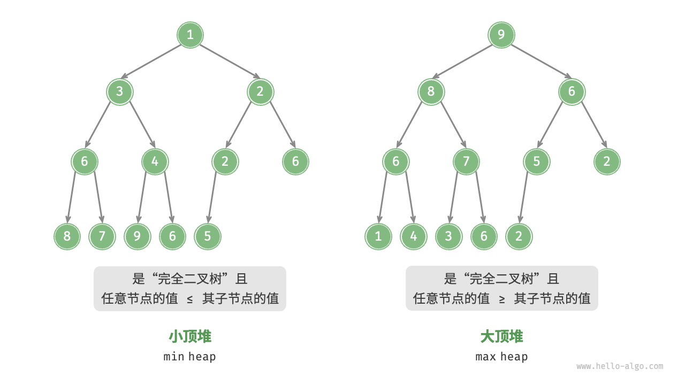

# 堆 (heap)

## 定义

[堆heap]是一种满足特定条件的[完全二叉树](../tree/Tree.md#完全二叉树)。

* 大顶堆 max heap：任意节点的值$\ge$其子节点的值。
* 小顶堆 min heap：任意节点的值$\le$其子节点的值。
  

## 特性

* 最底层节点靠左填充，其他层的节点都被填满。
* 我们将二叉树的根节点称为“堆顶”，将底层最靠右的节点称为“堆底”。
* 对于大顶堆（小顶堆），堆顶元素（根节点）的值是最大（最小）的。

堆通常用于实现优先队列，大顶堆相当于元素按从大到小的顺序出队的优先队列。
从使用角度看，我们可以将“优先队列”和“堆”看成等价的数据结构。

## STL的堆（优先队列）

```C++
//初始化小顶堆
priority_queue<int, vector<int>, greater<int>> min_heap;
//初始化大顶堆
priority_queue<int, vector<int>, less<int>> max_heap;
//元素入堆
max_heap.push(1);
max_heap.push(2);
max_heap.push(3);
max_heap.push(4);
max_heap.push(5);
max_heap.push(6);

min_heap.push(1);
min_heap.push(2);
min_heap.push(3);
min_heap.push(4);
min_heap.push(5);
min_heap.push(6);
min_heap.push(1);

//获取堆顶元素
int peek = min_heap.top();

//元素出堆
max_heap.pop();
min_heap.pop();

//获取堆大小
int size = max_heap.size();

//判空
bool isEmpty = min_heap.empty();

vector<int> input{1,2,3,4,5};
priority_queue<int, vector<int>, greater<int> > min_heap(input.begin(), input.end());
```
