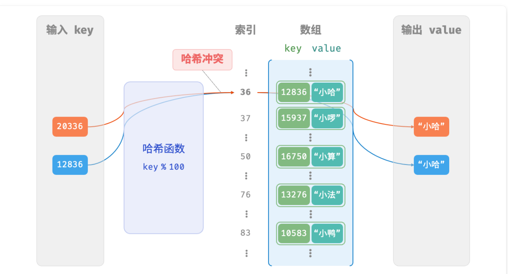

# 数据结构

## queue

### ***stl中的queue***

```cpp
#include <queue>
/*初始化队列*/
queue<int> queue;

/*元素入队*/
queue.push(1);
queue.push(2);
queue.push(3);
queue.push(4);
queue.push(5);

/*访问队首元素*/
int front = queue.front();

/*元素出队*/
queue.pop();

/*获取队列的长度*/
int size = queue.size();

/*判断队列是否为空*/
bool empty = queue.isEmpty();

```

### ***基于链表实现的queue***

```cpp
struct ListNode{
    int val;
    ListNode* next;
    ListNode(int x) : val(x), next(nullptr){};
}

class Queue {
    private:
        ListNode* front, *rear;
        int queue_size;

    public:
        Queue() {
           front = nullptr;
           rear = nullptr;
           queue_size = 0; 
        }

        void getSize() {
            return queue_size;
        }

        bool isEmpty() {
            return getSize() == 0;
        }

        void push(int num) {
            ListNode* node = new ListNode(num);
            if(!isEmpty()){
                rear -> next = node;
                rear = node;
            }
            else{
                front = node;
                rear = node;
            }
            queue_size++;
        }
        int pop() {
            int num = front -> val;
            ListNode* tmp = front;
            front = tmp -> next;
            delete tmp;
            queue_size--;
            return num;
        }
}
```

### ***基于数组实现的队列***

```c++
class ArrayQueue{
    private:
        int* nums;
        int front;
        int queue_size;
        int queue_capacity;
    public:
        ArrayQueue(int capacity){
            nums = new int[capacity];
            queue_capacity = capacity;
            front = queue_size = 0;
        }
        ~ArrayQueue(){
            delete[] nums;
        }

        int getSize(){
            return queue_size;
        }
        int getCapacity(){
            return queue_capacity;
        }
        bool isEmpty(){
            return queue_size == 0;
        }
        int peer(){
            if(isEmpty()){
                throw out_of_range("队列为空");
            }
            return nums[front];
        }
        int pop(){
            int num = peer();
            front = (front + 1) % queue_capacity;
            queue_size--;
            return num;
        }
        void push(int num){
            if(queue_size == queue_capacity)
            return;
            int rear = (front + queue_size) % capacity;
            nums[rear] = num;
            queue_size++;
        }
        vector<int> toVector(){
            vector<int> tmp(queue_size);
            for(int i = 0, j = front; i < queue_size; i++, j++)
            {
                tmp[i] = nums[j % queue_capacity];
            }
            return tmp;
        }
}
```

## deque 双向队列

### ***STL的双向队列***

```c++
/* 初始化双向队列  */
deque<int> deque;

/* 添加至队尾 */
deque.push_back(2);
deque.push_back(3);

/* 添加至队首 */
deque.push_front(4);
deque.push_front(5);

/* 访问队首 */
int front = deque.front();
/* 访问队尾 */
int back = deque.back();

/* 元素出队 */
deque.pop_front(); //队首元素出队
deque.pop_back(); //队尾元素出队

/* 获取双向队列的长度 */
int size = deque.size();

/* 判断双向队列是否为空 */
bool empty = deque.isEmpty();
```


## 哈希表

### ***STL的哈希表***

```c++
#include<unordered_map>

unordered_map<int, string> map;

map[1112] = "apple";
map[2233] = "banana";
map[1314] = "pineapple";

string name = map[2233];

map.erase(1314);

/* 遍历哈希表 */
for(auto kv : map) {
    cout << kv.first << "->" << kv.second << endl;
}
/* 迭代器遍历 */
for(auto iter = map.begin(); iter != map.end(); iter++) {
    cout << iter -> first << iter -> second << endl;
}
```

### ***基于数组实现的简单哈希表***

```c++
#define MAX_SIZE 100
#include<iostream>
#include<vector>

using namespace std;

struct Pair{
    int key;
    string val;
    Pair(int key, string val){
        this -> key = key;
        this -> val = val;
    }
}

class ArrayHashMap{
    private:
        vector<Pair *> buckets;
    public:
        ArrayHashMap(){
            buckets = vector<Pair *>(MAX_SIZE);
        }
        ~ArrayHashMap(){
            for(const auto& bucket : buckets){
                delete bucket;
            }
            buckets.clear();
        }
        int hashFunc(int key){
            return key % MAX_SIZE;
        }
        vector<int> getAllKey(){
            vector<int> key_set;
            for(auto& pair : buckets){
               if(pair -> key != nullptr){
                    key_set.push_back(pair -> key);
               } 
            }
            return key_set;
        }
        vector<string> getAllValue(){
            vector<string> val_set;
            for(auto& pair : buckets){
                if(pair -> val != nullptr){
                    val_set.push_back(pair -> val);
                }
            } 
            return val_set;
        }
        string get(int key){
            int index = hashFunc(key);
            if(buckets[index] -> val != nullptr){
                return buckets[index] -> val;
            }
            return "";
        }
        void push(int key, string val){
            int index = hashFunc(key);
            buckets[index] = new Pair(key, val);
        }
        void remove(int key){
            int index = hashFunc(key);
            delete buckets[index];
            buckets[index] = nullptr;
        }
        void print(){
            for(Pair* pair : buckets){
                cout << "[ " << pair -> key << " -> " << pair -> val << " ]";
            }
        }
}
```

## 哈希冲突

从本质上看，哈希函数的作用是将所有 key 构成的输入空间映射到数组所有索引构成的输出空间，而输入空间往往远大于输出空间。因此，理论上一定存在“多个输入对应相同输出”的情况。

对于上述示例中的哈希函数，当输入的 key 后两位相同时，哈希函数的输出结果也相同。例如，查询学号为 12836 和 20336 的两个学生时，我们得到：

```null
12836 % 100 = 36
20336 % 100 = 36
```

如图所示，两个学号指向了同一个姓名，这显然是不对的。我们将这种多个输入对应同一输出的情况称为「哈希冲突 hash collision」。



### 基于动态数组实现的可解决哈希冲突的简单哈希表