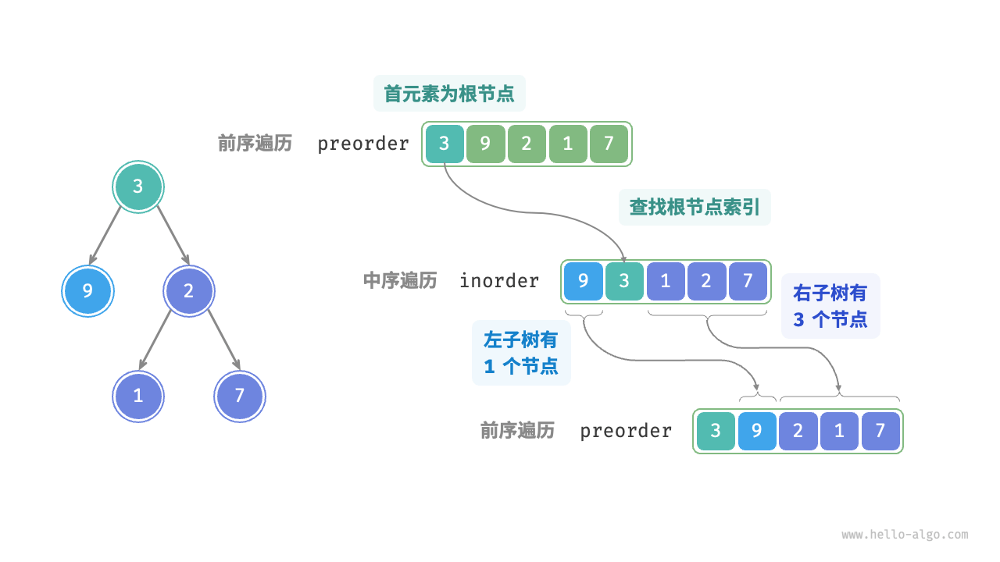

# 分治

## 分治问题

将大问题分解为多个子问题、解决子问题、将子问题的解合并为原问题的解。

## 构建树

给出一棵树得前序遍历和中序遍历，构建二叉树，返回根节点。

* 问题可以分解：从分治的角度切入，我们可以将原问题划分为两个子问题：构建左子树、构建右子树，加上一步操作：初始化根节点。而对于每棵子树（子问题），我们仍然可以复用以上划分方法，将其划分为更小的子树（子问题），直至达到最小子问题（空子树）时终止。
* 子问题是独立的：左子树和右子树是相互独立的，它们之间没有交集。在构建左子树时，我们只需关注中序遍历和前序遍历中与左子树对应的部分。右子树同理。
* 子问题的解可以合并：一旦得到了左子树和右子树（子问题的解），我们就可以将它们链接到根节点上，得到原问题的解。

preOrder:$[根节点 | 左子树 | 右子树]$
midOrder:$[左子树 | 根节点 | 右子树]$


* 将当前树的根节点在preOrder中的索引记为i.
* 将当前树的根节点在midOrder种得索引记为m.
* 将当前树在midOrder中得索引区间记为[l, r].

|        | 根节点在preorder中的索引 | 子树在inorder中的索引区间 |
| ------ | ------------------------ | ------------------------- |
| 当前树 | i                        | [l,r]                     |
| 左子树 | i+1                      | [l,m-1]                   |
| 右子树 | i+1+(m-l)                | [m+1,r] |

(m-l)是左子树节点的数量

```c++
TreeNode* dfs(vector<int> &preOrder, unordered_map<int,int> &midOrderMap, int i, int l, int r){
    if(r - l < 0)
        return NULL;
    //初始化根节点
    TreeNode* root = new TreeNode(preOrder[i]);
    //查询m，从而划分左右子树
    int m = midOrderMap[preOrder[i]];

    //子问题：构建左子树
    root -> left = dfs(preOrder, midOrderMap, i + 1, l , mid - 1);
    //子问题：构建右子树
    root -> right = dfs(preOrder, midOrderMap, i + 1 + (m - l), mid + 1, r);

    return root;
}

TreeNode* buildTree(vector<int> &preOrder, vector<int> &midOrder){
    // 初始化哈希表，存储 inorder 元素到索引的映射
    unordered_map<int,int> midOrderMap;
    for(int i = 0; i < midOrder.size(); i++){
        midOrderMap[midOrder[i]] = i;
    }

    return dfs(preOrder, midOrder, 0, 0, midOrder.size() - 1);
}
```