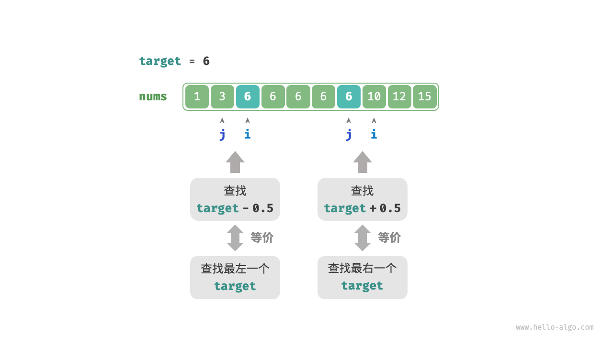

# 搜索算法

## 二分查找

### 查找左边界

### 查找右边界

#### 复用查找左边界

将查找最右一个$target$转化为查找最左一个$target + 1$。

#### 转化查找元素

当数组不包含target时，最终i和j会分别指向首个大于、小于target的元素。

* 查找最左一个target：可以转化为查找$target - 0.5$,并返回指针i.
* 查找最右一个target：可以转化为查找$target + 0.5$,并返回指针j.



##### tips

* 给定数组不包含小数。
* 需要将变量改为浮点数。

## 哈希优化

### problems

给定一个整数数组nums和一个目标元素target，请在数组中搜索“和”为target的两个元素。

#### 线性查找

```c++
pair<int,int> find(vector<int> &nums, int target){
    for(int i = 0; i < nums.size(); i++){
        for(int j = i + 1; j < nums.size(); j++)
            if(nums[i] + nums[j] == target)
                return make_pair(i, j);
    }
    return pair();
}
```

#### 哈希查找

```c++
vector<int> find(vector<int> &nums, int target){
    unordered_map<int, int> map;
    for(int i = 0; i < nums.size(); i++){
        if(map.find(target - nums[i]) != map.end())
            return {i, map[target - nums[i]]};
        map.emplace(nums[i] ,i);
    }
    return {};
}
```

##### 复杂度

空间复杂度:$O(n)$\
时间复杂度:$O(n)$