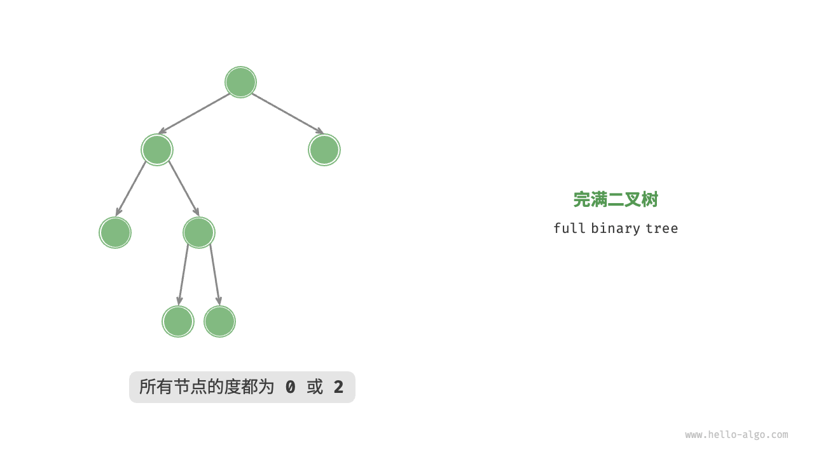
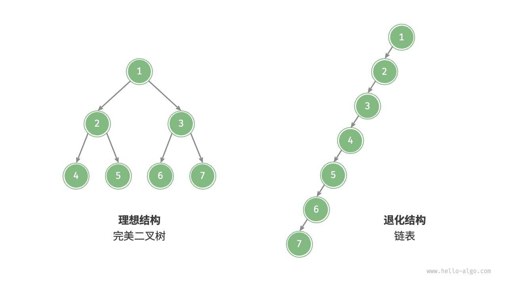
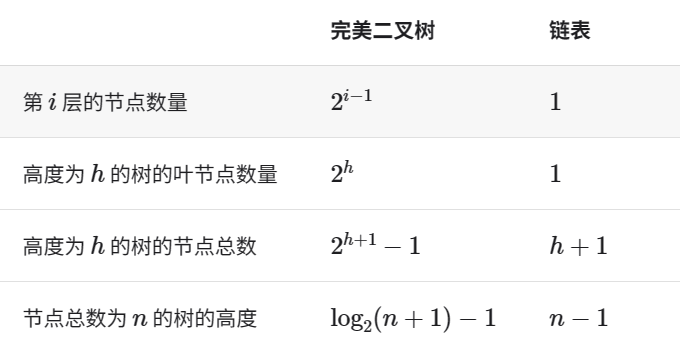
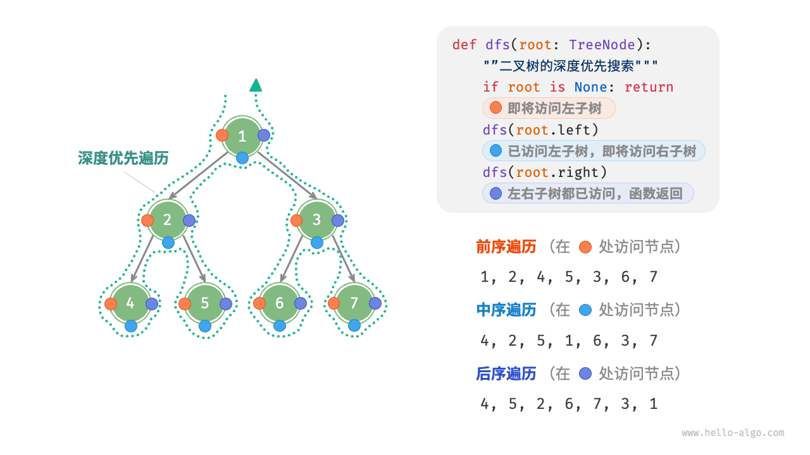
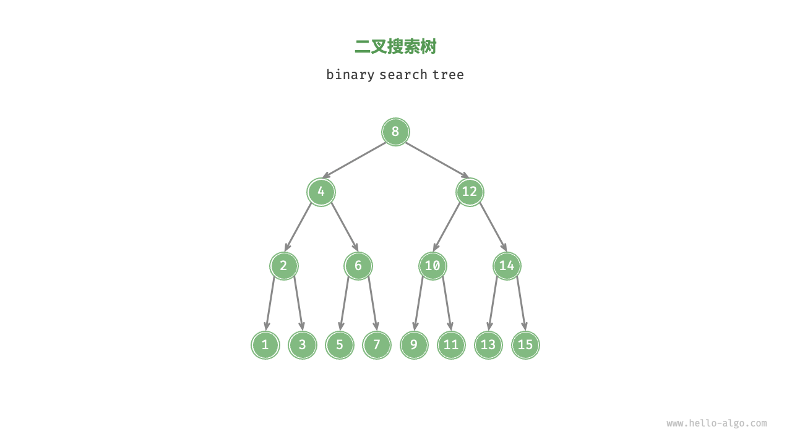

# 树

## 常用定义

* 「根节点 root node」：位于二叉树顶层的节点，没有父节点。
* 「叶节点 leaf node」：没有子节点的节点，其两个指针均指向 None 。
* 「边 edge」：连接两个节点的线段，即节点引用（指针）。
* 节点所在的「层 level」：从顶至底递增，根节点所在层为 1 。
* 节点的「度 degree」：节点的子节点的数量。在二叉树中，度的取值范围是 0、1、2 。
* 二叉树的「高度 height」：从根节点到最远叶节点所经过的边的数量。
* 节点的「深度 depth」：从根节点到该节点所经过的边的数量。
* 节点的「高度 height」：从距离该节点最远的叶节点到该节点所经过的边的数量。

## 二叉树

```c++
struct TreeNode
{
    int val;
    TreeNode* left;
    TreeNode* right;
    TreeNode(int x) : val(x), left(nullptr), right(nullptr){};
};

/* 初始化二叉树 */
    TreeNode* n1 = new TreeNode(1);
    TreeNode* n2 = new TreeNode(2);
    TreeNode* n3 = new TreeNode(3);
    TreeNode* n4 = new TreeNode(4);
    TreeNode* n5 = new TreeNode(5);
    /* 构建节点之间的引用（关系） */
    n1 -> left = n2;
    n1 -> right = n3;
    n2 -> left = n4;
    n2 -> right = n5;

    /* 插入节点P */
    TreeNode* P = new TreeNode(6);
    // 在n1和n2之间插入
    n1 -> left = P;
    P -> left = n2;

    /* 删除节点P */
    n1 -> left = n2;
    delete P;
```

## 常见二叉树类型

### 完美二叉树

如图所示，「完美二叉树 perfect binary tree」所有层的节点都被完全填满。在完美二叉树中，叶节点的度为0，其余所有节点的度都为2；若树的高度为h，则节点总数为$2^{h+1} -1$呈现标准的指数级关系，反映了自然界中常见的细胞分裂现象。

### 完全二叉树

如图所示，「完全二叉树 complete binary tree」只有最底层的节点未被填满，且最底层节点尽量靠左填充。

### 完满二叉树

如图所示，「完满二叉树 full binary tree」除了叶节点之外，其余所有节点都有两个子节点。

### 平衡二叉树

如图所示，「平衡二叉树 balanced binary tree」中任意节点的左子树和右子树的高度之差的绝对值不超过 1 。

### 二叉树的退化

图展示了二叉树的理想结构与退化结构。当二叉树的每层节点都被填满时，达到“完美二叉树”；而当所有节点都偏向一侧时，二叉树退化为“链表”。

* 完美二叉树是理想情况，可以充分发挥二叉树“分治”的优势。
* 链表则是另一个极端，各项操作都变为线性操作，时间复杂度退化至 $O(n)$。

如表所示，在最佳结构和最差结构下，二叉树的叶节点数量、节点总数、高度等达到极大值或极小值。 

## 二叉树的遍历

### 层序遍历

如图所示，「层序遍历 level-order traversal」从顶部到底部逐层遍历二叉树，并在每一层按照从左到右的顺序访问节点。

层序遍历本质上属于「广度优先遍历 breadth-first traversal」，也称「广度优先搜索 breadth-first search, BFS」，它体现了一种“一圈一圈向外扩展”的逐层遍历方式。

```c++
vector<int> levelOrder(TreeNode* root){
   queue<TreeNode* > queue;
   vector<int> vector_val;
   queue.push(root);

   while (!queue.empty())
   {
        TreeNode* node = queue.front();
        vector_val.push_back(node -> val);
        queue.pop();
        if(node -> left != nullptr){
            queue.push(node -> left);
        }
        if(node -> right !=nullptr){
            queue.push(node -> right);
        }
   }
   return vector_val;   
}
```

#### 复杂度分析

* 时间复杂度$O(n)$:所有节点被访问一次，使用$O(n)$时间，其中n为节点数量。
* 空间复杂度$O(n)$:在最差情况下，即满二叉树时，遍历到最底层之前，队列中最多同时存在$\frac{n+1}{2}$个节点，占用$O(n)$空间。

### 前序、中序、后序遍历

相应地，前序、中序和后序遍历都属于「深度优先遍历 depth-first traversal」，也称「深度优先搜索 depth-first search, DFS」，它体现了一种“先走到尽头，再回溯继续”的遍历方式。

图 7-10 展示了对二叉树进行深度优先遍历的工作原理。深度优先遍历就像是绕着整棵二叉树的外围“走”一圈，在每个节点都会遇到三个位置，分别对应前序遍历、中序遍历和后序遍历。

```c++
std::vector<TreeNode* > pre_order_set; //前序遍历数组
std::vector<TreeNode* > mid_order_set; //中序遍历数组
std::vector<TreeNode* > post_order_set; //后序遍历数组

void preOrderDFS(TreeNode* root){ 
    /* 前序遍历 */
    /* root - left - right */
    if(root == nullptr) 
        return;
    pre_order_set.push_back(root);
    preOrderDFS(root -> left);
    preOrderDFS(root -> right);
}

void midOrderDFS(TreeNode* root){
    /* 中序遍历 */
    /* left - root - right */
    if(root == nullptr) 
        return;
    midOrderDFS(root -> left);
    mid_order_set.push_back(root);
    midOrderDFS(root -> right);
}

void postOrderDFS(TreeNode* root){
    /* 后序遍历 */
    /* left - right - root */
    if(root == nullptr) 
        return;
    
    postOrderDFS(root -> left);
    postOrderDFS(root -> right);
    post_order_set.push_back(root);
}
```

#### 复杂度分析

* 时间复杂度$O(n)$:所有节点被访问一次，使用$O(n)$时间。
* 空间复杂度$O(n)$:在最差情况下，即树退化为链表时，递归深度达到n,系统占用$O(n)$栈帧空间。

## 数组表示二叉树

### 数组表示完美二叉树

给定一棵完美二叉树，我们将所有节点按照层序遍历的顺序存储在一个数组中，则每个节点都对应唯一的数组索引。

根据层序遍历的特性，我们可以推导出父节点索引与子节点索引之间的“映射公式”:若某节点的索引为i,则该节点的左子节点索引为$2i+1$,右子节点为$2i+2$。

```c++
/* 层序遍历 */
#define HEIGHT 10
#define CAPACITY (pow(2,HEIGHT+1) - 1)
int array_representation_binary_tree[CAPICITY];

vector<int> BFS(){
    vector<int> set;
    for(int i = 0; i < CAPACITY; i++){
        set.push_back(array_representation_binary_tree[i]);
    }
    return set;
}
```

### 表示任意二叉树

完美二叉树是一个特例，在二叉树的中间层通常存在许多 None 。由于层序遍历序列并不包含这些 None ，因此我们无法仅凭该序列来推测 None 的数量和分布位置。这意味着存在多种二叉树结构都符合该层序遍历序列。

为了解决此问题，我们可以考虑在层序遍历序列中显式地写出所有 None 。如图 7-14 所示，这样处理后，层序遍历序列就可以唯一表示二叉树了。

```c++
/* 二叉树的数组表示 */
//用INT_MAX代表NONE
vector<int> tree = {1,2,3,4,INT_MAX,6,7,8,9,INT_MAX,INT_MAX,12,INT_MAX,INT_MAX,14};
```


### 表示完全二叉树

完全二叉树非常适合使用数组来表示。回顾完全二叉树的定义，None 只出现在最底层且靠右的位置，因此所有 None 一定出现在层序遍历序列的末尾。

### 基本操作

* 给定某节点，获取它的值，左（右）子节点、父节点。
* 获取前序遍历，中序遍历，后序遍历，层序遍历序列。

```c++

class ArrayBinaryTree
{
private:
    vector<int> tree;

    void dfs(int i, string order, vector<int>& res){
        if(val(i) == INT_MAX)
            return;
        if(order == "pre")
            res.push_back(val(i));
        dfs(left(i), order, res);
        if(order == "mid")
            res.push_back(val(i));
        dfs(right(i), order, res);
        if(order == "post")
            res.push_back(val(i));
    } 
public:
    vector<int> pre_order_set;
    vector<int> mid_order_set;
    vector<int> post_order_set;
    ArrayBinaryTree(vector<int> arr){
        tree = arr;
    }
    ~ArrayBinaryTree(){
        vector<int> tmp;
        tree.swap(tmp);
    }

    /* 获取二叉树的大小 */
    int size(){
        return tree.size();
    }

    /* 获取索引值为i节点的值 */
    int val(int i){
        if(i < 0 || i >= size()){
            return INT_MAX;
        }
        return tree[i];
    }

    /* 获取索引值为i节点的左节点的索引值 */
    int left(int i){
        return 2 * i + 1;
    }

    /* 获取索引值为i节点的右节点的索引值 */
    int right(int i){
        return 2 * i + 2;
    }

    /* 获取索引值为i节点的父节点的索引值 */
    int parent(int i){
        return (i - 1) / 2;
    }

    vector<int> preOrder(){
        vector<int> res;
        dfs(0, "pre", res);
        return res;
    }
    
    vector<int> midOrder(){
        vector<int> res;
        dfs(0, "mid", res);
        return res;
    }
    
    vector<int> postOrder(){
        vector<int> res;
        dfs(0, "post", res);
        return res;
    }

    vector<int> leverOrder(){
        vector<int> res;
        for(int i = 0; i < size(); i++){
            if(tree[i] != INT_MAX){
                res.push_back(tree[i]);
            }
        }
        return res;
    }
};
```

### 优点与局限性

二叉树的数组表示主要有以下优点。

* 数组存储在连续的内存空间内，对缓存友好，访问与遍历速度较快。
* 不需要存储指针，比较节省空间。
* 允许随机访问节点。

然而，数组表示也存在一些局限性。

* 数组存储需要连续内存空间，因此不适合存储数据量过大的树。
* 增删节点需要通过数组插入与删除操作实现，效率较低。
* 当二叉树中存在大量的None时，数组中包含的节点数据比重较低，空间利用率较低。

## 二叉搜索树

二叉搜索树满足以下条件：

1.对于根节点，左子树中所有节点的值<根节点的值<右子树中所有节点的值。
2.任意节点的左、右子树也是二叉搜索树，即同样满足条件 1. 


### 二叉搜索树的操作

```c++
时间复杂度都是O(log n)
class BinarySearchTree
{
private:
    TreeNode* root;
    
public:
    BinarySearchTree(/* args */);
    ~BinarySearchTree();

    TreeNode* search(int num){
        TreeNode* cur = root;
        while(cur != nullptr){
            if((cur -> val) < num){
                cur = cur -> right;
            }else if((cur -> val) > num){
                cur = cur -> left;
            }else{
                return cur;
            }
        }
        return nullptr;
    }

    void insert(int num){
        if(root == nullptr){
            root = new TreeNode(num);
            return;
        }
        TreeNode* cur = root;
        TreeNode* pre;
        while(cur != nullptr){
            if(cur -> val == num){
                return;
            }

            pre = cur;

            if((cur -> val) > num){
                cur = cur -> left;
            }else {
                cur = cur -> right;
            }
        }
        TreeNode* node = new TreeNode(num);

        if((pre -> val) > num){
            node = pre -> left;
        }
        else {
            node = pre -> right;
        }
    }

    void remove(int num){
        if(root == nullptr)
            return;

        TreeNode *cur = root;
        TreeNode *pre = nullptr;

        while(cur != nullptr){
            if(cur -> val == num)
                break;
            pre = cur;
            
            if(cur -> val > num)
                cur = cur -> left;
            else 
                cur = cur ->right;
        }
        if(cur == nullptr)
            return;
        if(cur -> left == nullptr || cur -> right == nullptr){
            TreeNode* child = cur -> left != nullptr ? cur -> left : cur -> right;
            if(cur != root){
                if(pre -> left == cur){
                    pre -> left = child;
                }else {
                    pre -> right = child;
                }
            }else{
                root = child;
            }
            delete cur;
        }else{
            TreeNode* tmp = cur -> right;
            while(tmp -> left != nullptr){
                tmp = tmp -> left;
            }
            int tmp_val = tmp -> val;
            remove(tmp_val);
            cur -> val = tmp_val;
        }
    }
};

```

### 中序遍历有序

|二叉搜索树的中序遍历序列是升序的。

利用中序遍历升序的性质，我们在二叉搜索树中获取有序数据仅需$O(n)$时间，无须进行额外的排序操作，非常高效。

### 二叉搜索树的退化

在理想情况下，二叉搜索树是“平衡”的，这样就可以在 
 轮循环内查找任意节点。

然而，如果我们在二叉搜索树中不断地插入和删除节点，可能导致二叉树退化为图 7-23 所示的链表，这时各种操作的时间复杂度也会退化为$O(n)$。

### 二叉搜索树的应用

* 用作系统中的多级索引，实现高效的插入、查找、删除操作。
* 作为某些搜索算法的底层数据结构
* 用于存储数据流，以保持其有序状态。

## AVL树

为了解决平衡二叉树的退化问题。

1962 年 G. M. Adelson-Velsky 和 E. M. Landis 在论文“An algorithm for the organization of information”中提出了「AVL 树」。论文中详细描述了一系列操作，确保在持续添加和删除节点后，AVL 树不会退化，从而使得各种操作的时间复杂度保持在$O(n)$级别。换句话说，在需要频繁进行增删查改操作的场景中，AVL 树能始终保持高效的数据操作性能，具有很好的应用价值。

### 常见术语

#### 节点高度

“节点高度”是指从该节点到它的最远叶节点的距离，即所经过的“边”的数量。叶节点的高度为0，空节点的高度为-1。

#### 平衡因子

节点的「平衡因子 balance factor」定义为节点左子树的高度减去右子树的高度，同时规定空节点的平衡因子为0。

设平衡因子为f,则一颗AVL树的任意节点的平衡因子皆满足$-1 \le f \le -1$

### 旋转

#### 左旋

#### 右旋

#### 先左旋后右旋

#### 先右旋后左旋

### 四种旋转的选择


### AVL树的常用操作

#### 插入

#### 删除

#### 查询

## 红黑树

### 性质

1.节点是红色或黑色。
2.根是黑色。
3.所有叶子都是黑色（叶子是NIL节点）。
4.每个红色节点必须有两个黑色的子节点。（从每个叶子到根的所有路径上不能有两个连续的红色节点。）
5.从任一节点到其每个叶子的所有简单路径都包含相同数目的黑色节点（简称黑高）。